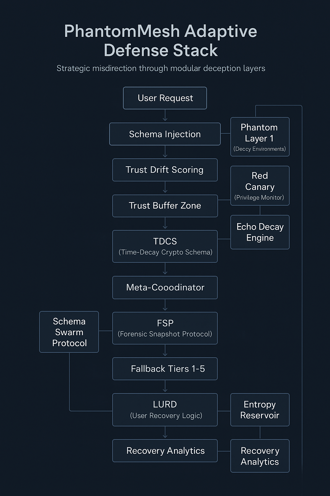

  
  
  

<em>Resilient misdirection through layered ambiguity.</em>

  

# Phantommesh
A schema based adaptive defense framework for strategic misdirection and resilient system containment.

# 🕸️ PhantomMesh  
_A Schema-Based Adaptive Defense Framework_

> “Deception, coordination, and resilience—by design, not afterthought.”  

---

## 📜 Preface

This document outlines a conceptual security framework intended to provoke thought, inspire innovation, and contribute to the evolving conversation around adaptive defense strategies.

**PhantomMesh** is a speculative design authored independently, exploring how schema-driven deception, trust drift analytics, and behavioral misdirection could reshape defensive infrastructure. It is not a product, but rather a blueprint for what may be possible when deception is treated as a core design principle.

This work is shared in good faith and with the hope it sparks innovation, critique, or collaboration.

---

## 🧠 Executive Summary

PhantomMesh is an adaptive security concept built to outmaneuver modern threats through:

- **Schema-driven behavioral control**
- **Phantom environments to deceive adversaries**
- **Time-decaying schema encryption**
- **Trust drift monitoring & ambiguous session buffering**
- **Adaptive fallback tiers**

The goal: confuse, contain, and learn from adversaries—instead of merely blocking them.

---

## 🧱 Architecture Overview

- App-side schema injection
- Server-side handshake verification
- Phantom Layer 1/2 decoys
- Trust drift scoring engine
- Cryptographic schema mutation
- Multi-tier fallback system

These elements work as a modular, evolving ecosystem—always adjusting, always observing.

---

## 📦 Module Breakdown

| Module         | Name                             | Function |
|----------------|----------------------------------|----------|
| HHP            | Heartbeat Harmony Protocol        | Trust drift via timing/entropy sync |
| Trust Buffer   | Drift Buffer Layer                | Ambiguous session quarantine |
| TDCS           | Time-Decay Crypto Schema          | Mutation + expiration-based validation |
| Red Canary     | Insider Privilege Monitor         | Schema manipulation detection |
| FSP            | Forensic Snapshot Protocol        | Tier 4 forensic state capture |
| Echo Decay     | Schema Entropy Drift Engine       | Entropy degradation over time |
| LURD           | Legitimate User Recovery Directive| Resilient user re-entry |
| SSP            | Schema Swarm Protocol             | Entropy-split logic for replay resilience |

---

## 🎯 Use Cases

- Credential flooding = Phantom login + schema mismatch
- Insider escalation = Red Canary triggers schema lock
- Replay attacks = TDCS expiration + entropy sync
- AV conflict = Fallback to Tier 1 with signed ops
- Post-attack cleanup = FSP snapshot + schema reinit

---

## 🛡️ Fallback Tiers

PhantomMesh degrades gracefully through 5 tiers—from full-deception deployment to minimal-logging recovery mode. Trust continuity and user safety remain preserved.

---

## 💡 Why This Matters

Modern threats aren’t static. Our defenses shouldn’t be either. PhantomMesh proposes resilience not through brute force, but through misdirection, mutation, and anticipation.

---

## 🧾 Afterword from the Architect

PhantomMesh didn’t begin with code—it began with a question: “What if a system could adapt the way a threat adapts—without becoming one?”

What started as a spark of curiosity became a blueprint. Now, that blueprint is taking shape—schema by schema, layer by layer. I’m building this not out of obligation, but out of instinct. Because deception, adaptability, and trust-aware logic aren’t just features—they're necessary evolutions.

I still don’t claim perfection. This isn’t a product pitch. But it’s real. And it’s mine. Born not just from hours of research or tinkering, but from a brain that sees systems differently.

I’m an Independent Security Thinker. I’m proudly autistic. And this PhantomMesh—isn’t a workaround. It’s the result of designing without compromise.

For anyone who’s ever thought differently and wondered if that difference could be a strength—this framework is your reminder: It always was.

— DriftInSilence (Thomas) Independent Security Thinker Unapologetically different. Deliberately building.

> — DriftInSilence (Thomas)  
> Independent Security Thinker  
> Proudly autistic. Unapologetically different.

---

## 🛠️ License

Licensed under the [Creative Commons Attribution 4.0 International (CC BY 4.0)](https://creativecommons.org/licenses/by/4.0/).
